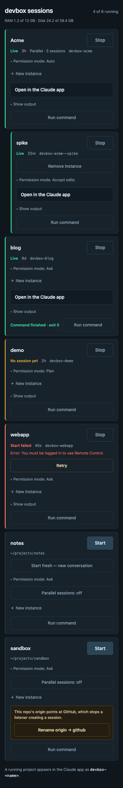
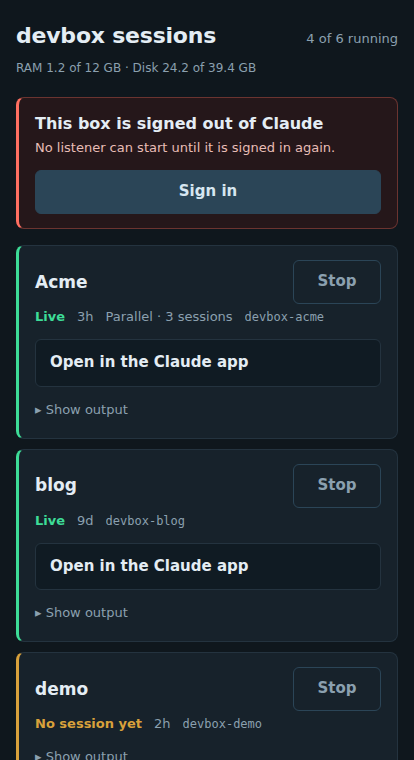

# devbox-launcher

A small web UI for starting and stopping [Claude Code](https://claude.com/claude-code)
`remote-control` listeners on a headless development box — one per git project —
so you can open a session from your phone without SSHing in.

The launcher only starts, stops and monitors listeners. You drive the actual
session in the Claude mobile app or at claude.ai/code.

<p align="center">
  
</p>

Every row is a project. The coloured rail is a health signal, not just
"process alive" — green means a session is actually live and reachable from the
app, amber means the listener is registered but idle, red means it failed or
wedged and carries the CLI's own error underneath it.

When the box's Claude login expires every listener fails the same way, so the
launcher lets you fix that from the phone too, without a shell:

<p align="center">
  
</p>

<sub>Screenshots are rendered from fabricated data by
<a href="docs/demo_server.py">docs/demo_server.py</a>, which stubs the tmux, git
and Claude CLI boundaries and lets the real UI code draw the page.</sub>

> **Read [SECURITY.md](SECURITY.md) before installing.** This service starts AI
> agent sessions that can read and write your code, and it has **no
> authentication of its own**. It is designed to sit behind Tailscale.

## Requirements

- Linux with **systemd** (user services + lingering). Developed on Ubuntu 24.04
  in an LXC container.
- **Python 3.12+** with `venv`
- **tmux** — used as the process supervisor for listeners
- **git**
- **Claude Code CLI** on `PATH`, signed in to a claude.ai subscription that
  includes Remote Control
- **Tailscale** — the intended and only recommended way to reach the UI

## Install

```bash
git clone https://github.com/<you>/devbox-launcher.git
cd devbox-launcher
./install.sh
```

Run it as the user whose sessions you want to manage — not as root. It creates a
venv, installs the package, writes a systemd `--user` unit, enables lingering
(the one step that needs `sudo`), starts the service and waits for it to answer.

Then publish it to your tailnet:

```bash
tailscale serve --bg 8765
```

The UI is now at `https://<host>.<your-tailnet>.ts.net`. This needs tailnet
HTTPS certificates enabled once, in the Tailscale admin console under DNS.

Re-run `./install.sh` to update after a `git pull`; it force-reinstalls and
restarts. Running listeners survive the restart (the unit sets
`KillMode=process`).

## Configuration

All optional, read from the environment by the systemd unit:

| Variable | Default | Meaning |
|---|---|---|
| `LAUNCHER_BASE_DIR` | `~/projects` | Directory scanned for projects |
| `LAUNCHER_HOST` | `127.0.0.1` | Bind address — see SECURITY.md before changing |
| `LAUNCHER_PORT` | `8765` | Bind port |
| `LAUNCHER_VENV` | `~/.local/share/devbox-launcher/venv` | Install location (install-time only) |
| `LAUNCHER_RUN_USER` | *(empty)* | Tailnet login allowed to use **Run command**; empty hides the feature — see below |

## How projects are discovered

Everything under `LAUNCHER_BASE_DIR` that is either:

- a **git repo** — a directory containing `.git`; or
- a **group** — a directory containing a `claude-project/` subdirectory
  alongside several code repos. Claude launches in `claude-project/`, which acts
  as the config and history anchor, and reaches the sibling repos normally.

A directory that is both is treated as a repo.

## Using it

Tap **Start** and a listener comes up as `devbox-<slug>`; pick that name in the
Claude app. The coloured rail on each row is a health signal, not just
"process alive":

| Rail | Means |
|---|---|
| green — *Live* | a session is live and reachable from the app |
| amber — *No session yet* / *Starting…* | registered, but no session yet |
| red — *Start failed* | session creation failed; the CLI's error is shown |
| red — *Stuck* | up but silent for 30 s — wedged rather than slow |

Start takes about 7 seconds because it waits for the listener to settle, so the
row tells the truth immediately rather than flipping states under you.

Other controls: **Retry** (stop, clear the resume pointer, start again),
**Start fresh** (discard the recorded conversation), **Parallel sessions**
(`--spawn worktree`, so each session gets its own git worktree and several can
edit at once), **Show output** (last 20 lines of the pane, fetched on demand),
and the three below.

**Permission mode.** Every row has a `▸ Permission mode` disclosure with four
chips: **Ask**, **Accept edits**, **Auto**, **Plan**. This is
`claude remote-control --permission-mode`, which the CLI fixes at listener
startup and the Claude app cannot change afterwards — so before this, a session
stuck asking about every edit could only be fixed from a terminal. On a
stopped row it sets what the next Start uses; on a running row it restarts the
listener (a few seconds) and resumes the same conversation. **Ask** passes no
flag, so the CLI's own default (and any `defaultMode` in
`~/.claude/settings.json`) applies. `bypassPermissions` and `dontAsk` are
deliberately not offered; see [docs/how-it-works.md](docs/how-it-works.md).

### Instances: a second copy of a project

**New instance** on a project row creates a git worktree at
`<launch dir>/.claude/worktrees/<name>` on branch `<name>` (reused if it
exists, otherwise cut from the project's current checkout) and starts a
listener for it. It shows up in the Claude app as `devbox-<slug>--<name>` and
on the page as an indented row under its project with the same controls.

**Remove instance** stops the listener and deletes the worktree. It refuses,
and says why, when the worktree has uncommitted changes, commits on no remote,
or a gitignored *file* at its top level (a `.env`, a scratch note — `git
status` is silent about those but `git worktree remove` deletes them). There is
no force button on purpose: this is driven from a phone. Commit and push, then
remove. The branch is left behind either way.

Instances survive a reboot like any other listener. Worktrees the Claude app
makes for its own parallel sessions are **not** instances and never appear as
rows.

### Run a command (from the phone)

Claude sometimes needs **you** to run a command: one its permission check
refuses (it changes production) or one that waits for input (a login). Over
Remote Control `! <command>` cannot be typed, so each project row can carry a
**Run command** button. It opens a modal: paste the command, tap **Run**, and
it runs in the project's launch dir with the output shown live. A prompt? Type
the answer and **Send**. **Ctrl-C** interrupts. When it exits, **Copy output**
copies command, output and exit code for pasting back to Claude.

Closing the modal does not stop the command; the row says *Command running* /
*Command finished · exit N* until you tap **Done**. One command per project at
a time. Each runs as the launcher's user in `bash -lc` inside tmux session
`launcher-run-<slug>` on the launcher's socket, so
`tmux -L devbox-launcher attach -t launcher-run-<slug>` takes it over from a
shell. Every run is logged to the journal; what you type at a prompt is not.

**This is a shell on the box, so it is off until you opt in** by setting
`LAUNCHER_RUN_USER` to your tailnet login (the `Tailscale-User-Login` header
that Tailscale Serve adds to every request it proxies, e.g.
`LAUNCHER_RUN_USER=you@example.com ./install.sh`). Anyone else gets 403, and
POSTs must be same-origin. Read the *Run command* section of
[SECURITY.md](SECURITY.md) before enabling it — in particular, tell your Claude
sessions to hand you commands rather than call the endpoint themselves; a
ready-made `CLAUDE.md` block is in [docs/claude-md-snippet.md](docs/claude-md-snippet.md).

Listeners cost roughly 165 MB each and are started on demand. tmux sessions do
not survive a reboot, but the launcher records intent in
`~/.local/state/devbox-launcher/desired.json` and replays it at startup.

**The `origin` gotcha.** If a repo has an `origin` remote pointing at GitHub,
session creation can fail a repo-access check. The launcher detects this and
offers a one-tap **Rename origin → github** button. See
[docs/troubleshooting.md](docs/troubleshooting.md) for the proper fix
(granting the Claude GitHub App access to the repo).

## Documentation

- [SECURITY.md](SECURITY.md) — threat model; read it first
- [docs/how-it-works.md](docs/how-it-works.md) — architecture and design notes
- [docs/troubleshooting.md](docs/troubleshooting.md) — failure modes seen in practice
- [docs/claude-md-snippet.md](docs/claude-md-snippet.md) — tell Claude sessions about Run command and instances

## Known limitations

- **It parses terminal output.** Health is scraped from `tmux capture-pane`,
  including the literal `Capacity: N/32` line that `claude remote-control`
  prints. This is coupled to Claude Code's TUI and **will break** when that
  output changes. There is no stable API for this; the tests pin the strings
  currently relied on.
- **It has been run in exactly one environment** — an Ubuntu 24.04 LXC on
  Proxmox. The install script should be portable to any systemd Linux, but
  yours may well be the second machine it has ever touched. Bug reports
  welcome.
- **Linux only.** `hostinfo.py` reads `/proc/meminfo` (and is lxcfs-aware so it
  reports a container's limit rather than the host's).
- **No multi-user support.** One launcher, one Unix user, one Claude account.
  `LAUNCHER_RUN_USER` names one person, not a list.

## Development

```bash
python3 -m venv .venv
.venv/bin/pip install -e . pytest httpx
.venv/bin/python -m pytest
```

409 tests, no network, tmux or git required — the tmux and CLI boundaries are driven
through injected runners.

To regenerate the README screenshots, serve the UI against fabricated data and
capture it at a phone viewport (414 px wide):

```bash
python docs/demo_server.py                 # http://127.0.0.1:8799/
python docs/demo_server.py --signed-out    # the signed-out banner
```

## License

MIT — see [LICENSE](LICENSE).
